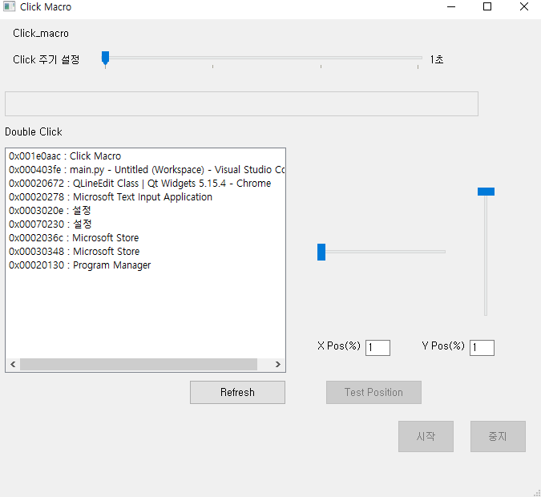

# Click Macro for Window

타겟 프로그램(Window)를 설정하고, 해당 프로그램 안에서 원하는 위치에 클릭 이벤트를 발생시킵니다.

다른 업무를 수행 중이더라도 잠깐 타겟 프로그램을 ForeGround로 보내 클릭 후 다시 원래의 Window로 돌아갑니다.

스크롤바를 통해 상대적 위치를 직관적으로 설정할 수 있으며, 설정 위치를 'Test Position'으로 확인 할 수 있습니다.

- 2021-05-16 update

    - Macro 시작 / 중지 기능 정상화 (thread)
    - 버튼 enable / disable 처리 디테일
    - X / Y Position Slide 입력 기능 추가

 

# Memo & TODO

- 21-05-12 (clear)

class가 "ApplicationFrameWindow"인 '계산기' 등의 프로그램은 FindWindow 할 시에 반드시 class를 지정해 주어야함.

`hwnd = win32gui.FindWindow("ApplicationFrameWindow", self.name)`

hwnd 문제 때문에 get_window_title로 모든 title을 받아서 select하여 설정하는 방식으로 구현 할 것.

- 21-05-13 (clear)
 
gui class, window control class, main 기본 연결 완료.

- 21-05-14 TODO

[pynput](https://github.com/moses-palmer/pynput) -> mouse listner를 통해서 클릭 위치를 받아 올 것.

adjustment 버튼 클릭 -> 마우스 움직일 때 마다 좌표 업로드. 클릭시 해당 좌표 기억.

sequence 만들기. 클릭, 엔터, 타이핑 등의 sequence를 추가하여 run 할 수 있도록 구현

- 21-05-15 TODO (clear)

thread 시작->중지 가능. 현재는 5번만 반복.

test position 업데이트. click macro 동작 확인.

- 21-05-16 TODO

설정 값 기억 (config.yaml)

 

참고

https://wikidocs.net/35496

https://doc.qt.io/qt-5/qlistview.html

https://opentutorials.org/module/544/9391
